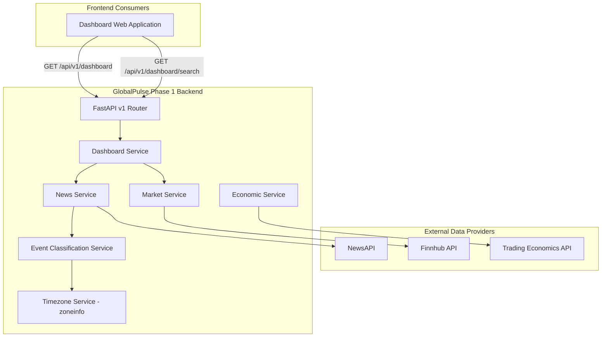

# GlobalPulse Phase 1 Backend — Functional Requirements Document (FRD)

```
Document Reference : GP-FRD-PH1-001
Document Version   : 1.0.0
Status             : Approved for Phase 1 Baseline
Target Audience    : Business Analysts (BA), Product Managers (PM), Frontend Engineers, QA
Author             : Antigravity AI / GlobalPulse Engineering Team
Release Date       : July 2026
```

---

## 1. Document Overview & Executive Summary

### 1.1 Purpose
This Functional Requirements Document (FRD) specifies the complete functional capabilities, behavioral rules, data workflows, and interface contracts implemented in **Phase 1 of the GlobalPulse Backend** (`globalpulse-backend`). 

The document serves as the single source of truth for Business Analysts (BA), Product Managers, and Frontend Engineering teams developing the GlobalPulse Dashboard UI.

### 1.2 Business Context
GlobalPulse is an India-centric global financial intelligence platform designed to eliminate financial noise and deliver real-time, actionable market awareness. 

Phase 1 provides the core backend aggregation and intelligence foundation: ingesting global news, market prices, macroeconomic indicators, and exchange statuses; classifying events deterministically; and exposing a clean, normalized, frontend-friendly API contract for the Dashboard.

### 1.3 Scope Boundaries

#### In-Scope for Phase 1 Backend
- **Phase 1A**: Application foundation, environment configuration, structured logging, centralized domain exception handling, health checks (`GET /api/v1/health`).
- **Phase 1B**: Market data integration via Finnhub (`/markets`, `/instruments/{symbol}`, `/quotes/{symbol}`).
- **Phase 1C**: Timezone & Market Session Engine supporting 10 global exchanges across 8 countries, converting all timestamps to UTC and IST (`/market-status`).
- **Phase 1D**: Macroeconomic data ingestion via Trading Economics (`/economic-events`, `/commodities`, `/forex`, `/bonds`).
- **Phase 1E**: Global news ingestion via NewsAPI, 11-category rule-based event classification, ISO country tagging, static company/sector tagging, and financial relevance scoring (`/news`, `/global-events`).
- **Dashboard Backend**: Unified feed aggregation, single-pass article processing, multi-criteria filtering, free-text search, latest/oldest sorting, pagination, deduplication, and optional quote context enrichment (`/dashboard`, `/dashboard/search`).

#### Explicitly Out-of-Scope for Phase 1 (Deferred to Future Phases)
- India Impact Engine & Severity Scoring (Phase 2+)
- Ripple Effect Engine & Market Chain Analysis (Phase 3)
- AI / LLM-powered natural language explanations (Phase 4)
- User Authentication, Profiles, Portfolio, Goals, & Subscriptions (Phase 5)
- Push Notifications, WebSockets, Kafka, Redis, or Microservices infrastructure.

---

## 2. System Context & User Personas

### 2.1 User Personas

| Persona ID | Persona Name | Role / Description | Primary Goal in Phase 1 |
|------------|--------------|--------------------|-------------------------|
| **PER-01** | **Indian Retail Investor** | Active retail trader or long-term investor in India. | Desires real-time awareness of global macroeconomic events impacting markets without manual filtering. |
| **PER-02** | **Financial Analyst** | Analyst monitoring global market trends & corporate developments. | Requires categorized, search-enabled, tagged market news with financial relevance filtering. |
| **PER-03** | **Frontend Application** | Next.js / Vite React Dashboard web client. | Expects a single normalized JSON API endpoint that loads the dashboard feed in < 200ms. |

### 2.2 System Context Diagram



---

## 3. Detailed Functional Requirements

---

### Module 1: System Health & Foundation (Phase 1A)

#### FR-01: System Health Verification
- **Requirement**: The backend MUST expose an unauthenticated health check endpoint returning service readiness, application name, version, and server timestamp.
- **Endpoint**: `GET /api/v1/health`
- **Business Logic**:
  - Validates that the FastAPI application lifespan has completed startup successfully.
  - Returns HTTP 200 with JSON payload: `{"status": "healthy", "service": "GlobalPulse API", "version": "1.0.0"}`.

#### FR-02: Centralized Error Handling & Masking
- **Requirement**: Internal provider stack traces, database details, or credentials MUST NEVER be exposed to API consumers.
- **Business Logic**:
  - Intercepts all uncaught domain exceptions and returns standardized error JSON:
    ```json
    {
      "error": {
        "code": "PROVIDER_UNAVAILABLE | VALIDATION_ERROR | NOT_FOUND",
        "message": "User-friendly, actionable error description.",
        "timestampUtc": "2026-07-28T15:00:00Z"
      }
    }
    ```

---

### Module 2: Global Market Data & Instruments (Phase 1B)

#### FR-03: Normalized Real-Time Market Quotes
- **Requirement**: The system MUST retrieve real-time market quotes for requested ticker symbols and normalize them into a uniform schema.
- **Endpoint**: `GET /api/v1/quotes/{symbol}`
- **Business Logic**:
  - Accepts uppercase ticker symbols (e.g. `AAPL`, `MSFT`).
  - Calls `MarketService` → `FinnhubMarketProvider`.
  - Normalizes prices, percentage change, session open, high, low, previous close.
  - Enriches quote currency from instrument metadata (returns `null` if provider does not expose currency; never fabricates).
  - Returns timestamps in both UTC and IST (`timestamp_utc`, `timestamp_ist`).

#### FR-04: Instrument Metadata Lookup
- **Requirement**: The system MUST provide instrument metadata profile information for valid symbols.
- **Endpoint**: `GET /api/v1/instruments/{symbol}`
- **Business Logic**: Returns company name, listing exchange, headquarters country, asset type (EQUITY, ETF, INDEX), and currency.

#### FR-05: Exchange Registry Directory
- **Requirement**: The system MUST maintain a static exchange registry supporting 10 major global exchanges across 8 countries.
- **Endpoint**: `GET /api/v1/markets`
- **Supported Exchanges**:
  1. `NSE` (India — National Stock Exchange of India)
  2. `BSE` (India — BSE Limited)
  3. `SGX` (Singapore — Singapore Exchange)
  4. `TSE` (Japan — Tokyo Stock Exchange)
  5. `HKEX` (Hong Kong — Hong Kong Exchanges)
  6. `NYSE` (United States — New York Stock Exchange)
  7. `NASDAQ` (United States — Nasdaq Stock Market)
  8. `LSE` (United Kingdom — London Stock Exchange)
  9. `XETRA` (Germany — Deutsche Börse Xetra)
  10. `EURONEXT_PARIS` (France — Euronext Paris)

---

### Module 3: Timezone & Market Session Engine (Phase 1C)

#### FR-06: Dual UTC & IST Time Normalization
- **Requirement**: EVERY timestamp returned by ANY backend endpoint MUST be provided in both UTC (Coordinated Universal Time) and IST (Indian Standard Time, `Asia/Kolkata`).
- **Business Logic**:
  - Handled via `TimezoneService` using Python standard library `zoneinfo`.
  - Daylight Saving Time (DST) transitions (EST/EDT, GMT/BST) are handled dynamically based on exchange timezone.
  - Manual `+05:30` arithmetic string appending is STRICTLY PROHIBITED.

#### FR-07: Exchange Session Status Engine
- **Requirement**: The backend MUST compute whether any supported global exchange is currently `OPEN` or `CLOSED`.
- **Endpoint**: `GET /api/v1/market-status` and `GET /api/v1/market-status/{exchange}`
- **Business Logic**:
  - Evaluates current exchange local time against configured trading session windows (including multi-session lunch breaks for TSE and HKEX).
  - Calculates `next_open_utc`, `next_open_ist`, `next_close_utc`, `next_close_ist`.
  - Includes `holiday_calendar_applied: false` flag for public disclosure.

---

### Module 4: Macroeconomic Data Integration (Phase 1D)

#### FR-08: Economic Calendar Data
- **Requirement**: System MUST ingest economic calendar releases (interest rates, CPI inflation, GDP, employment metrics) via Trading Economics.
- **Endpoint**: `GET /api/v1/economic-events`

#### FR-09: Macro Asset Pricing (Commodities, Forex, Bonds)
- **Requirement**: System MUST provide normalized pricing for key macro indicators.
- **Endpoints**:
  - `GET /api/v1/commodities` (Crude Oil, Gold, Silver, Natural Gas)
  - `GET /api/v1/forex` (USD/INR, EUR/USD, GBP/USD, USD/JPY)
  - `GET /api/v1/bonds` (US 10Y, India 10Y, UK 10Y Yields)

---

### Module 5: News Classification, Entity Tagging & Relevance (Phase 1E)

#### FR-10: Rule-Based News Event Classification
- **Requirement**: News articles ingested via NewsAPI MUST be categorized into exactly one primary category and zero or more secondary tags.
- **Business Logic**:
  - Classification is 100% rule-based and deterministic — NO LLM or non-deterministic AI.
  - **11 Categories**:
    1. `FINANCIAL_MARKETS`
    2. `ECONOMY`
    3. `CENTRAL_BANK`
    4. `CORPORATE`
    5. `GEOPOLITICS`
    6. `WAR_CONFLICT`
    7. `NATURAL_DISASTER`
    8. `SUPPLY_CHAIN`
    9. `ENERGY`
    10. `TECHNOLOGY`
    11. `OTHER`

#### FR-11: Country Tagging
- **Requirement**: Extracts ISO 3166-1 alpha-2 country codes (e.g. `IN`, `US`, `SG`, `JP`) from article headline and summary text.

#### FR-12: Company & Sector Tagging
- **Requirement**: Matches recognized global companies from static configuration (~50 major global firms e.g. Apple, Microsoft, Shell, Reliance, Infosys, TSMC) and extracts industry sector tags.

#### FR-13: Financial Relevance Filtering
- **Requirement**: Evaluates each article to determine if it is financially relevant using transparent signal weights.
- **Business Logic**:
  - Computes `relevance_score` (int) based on category weight + financial keywords ("inflation", "interest rate", "stock market", "yield", "tariff") + company presence + sector weight.
  - Threshold: If `relevance_score >= 2`, `financially_relevant = True`.

---

### Module 6: Dashboard Feed & Search Engine (Dashboard Backend)

#### FR-14: Main Dashboard Feed Endpoint
- **Requirement**: The backend MUST expose a single unified Dashboard feed endpoint (`GET /api/v1/dashboard`) returning normalized feed items, pagination metadata, and generation timestamps.
- **Business Logic**:
  - Orchestrates single-pass article retrieval from `NewsService`.
  - Articles are processed once; double-fetching or separate global-events fetching is PROHIBITED.
  - Item Classification (`type`):
    - If `financially_relevant == True`: `type = "GLOBAL_EVENT"`
    - Otherwise: `type = "NEWS"`
  - Presentation Impact Level (`impactLevel`):
    - Defaults to `"UNKNOWN"` unless an explicit provider importance signal is present.
    - `relevance_score` is NOT mapped to impact level to preserve separation between financial relevance and event severity.

#### FR-15: Multi-Criteria Filtering
- **Requirement**: The Dashboard feed MUST support combinable filtering in the service layer:
  - `category`: String (e.g. `ENERGY`, `GEOPOLITICS`)
  - `country`: String matching ISO alpha-2 code or country name (e.g. `Singapore` or `SG`)
  - `company`: String matching company tag or ticker (e.g. `Apple` or `AAPL`)
  - `sector`: String matching sector name (e.g. `Technology`)
  - `type`: String (`NEWS` or `GLOBAL_EVENT`)
  - `from` / `to`: Publication date range (`YYYY-MM-DD`)

#### FR-16: Latest / Oldest Sorting
- **Requirement**: Supports `sort=latest` (default, descending `published_at_utc`) and `sort=oldest` (ascending `published_at_utc`).

#### FR-17: Service-Layer Pagination
- **Requirement**: Implements 1-indexed pagination with configurable page size (`page` default 1; `pageSize` default 20, max 100). Validates page parameters (returns 422 if `page < 1` or `pageSize > 100`).

#### FR-18: Dashboard Content Search
- **Requirement**: System MUST expose a free-text search endpoint (`GET /api/v1/dashboard/search?q={query}`).
- **Business Logic**:
  - Searches normalized content across `headline`, `summary`, `category`, `countries`, `companies`, and `sectors`.
  - Supports the same filters, sorting, and pagination as the main feed.
  - Returns 422 if `q` parameter is empty or whitespace.

#### FR-19: Feed Deduplication
- **Requirement**: Prevents duplicate news items within the feed response.
- **Business Logic**: Deduplicates items using article URL, provider article ID, and normalized headline SHA-256 hash.

#### FR-20: Optional Market Context Quote Enrichment & Failure Isolation
- **Requirement**: For feed items containing recognized company tags mapped to valid stock symbols, the service MAY attach lightweight quote context (`symbol`, `price`, `changePercent`, `timestampUtc`, `timestampIst`).
- **Business Logic & Safety Rules**:
  - Bounded concurrency: max 3 symbols per feed item, max 10 total unique symbols per page response.
  - **Failure Isolation**: If quote enrichment fails (e.g., Finnhub timeout/rate limit), the error is caught silently, and the feed item is returned with `marketContext: []`. Quote failures MUST NEVER crash the Dashboard response.

---

## 4. Dashboard Data Contract (JSON Schemas)

### 4.1 Schema Naming Conventions
- **Python Code**: Attributes use `snake_case`.
- **JSON Serialization**: Pydantic models automatically convert fields to `camelCase` (via `alias_generator=to_camel` and `populate_by_name=True`), matching frontend expectations.

### 4.2 Main Dashboard Response Schema (`DashboardResponse`)

```json
{
  "generatedAtUtc": "2026-07-28T15:10:00Z",
  "generatedAtIst": "2026-07-28T20:40:00+05:30",
  "feed": [
    {
      "id": "a9f81b2c3d4e5f67",
      "type": "GLOBAL_EVENT",
      "headline": "Global oil supplies tighten as Singapore port congestion grows",
      "summary": "Crude oil futures rose by 3% following supply chain bottlenecks across Southeast Asia.",
      "category": "ENERGY",
      "impactLevel": "UNKNOWN",
      "countries": [
        "SG"
      ],
      "companies": [
        {
          "name": "Shell",
          "sector": "Energy",
          "country": "GB"
        }
      ],
      "sectors": [
        "Energy"
      ],
      "publishedAtUtc": "2026-07-28T12:00:00Z",
      "publishedAtIst": "2026-07-28T17:30:00+05:30",
      "sourceName": "Financial Times",
      "articleUrl": "https://ft.com/article-100",
      "financiallyRelevant": true,
      "marketContext": [
        {
          "symbol": "SHEL",
          "price": 68.40,
          "changePercent": 1.25,
          "timestampUtc": "2026-07-28T14:55:00Z",
          "timestampIst": "2026-07-28T20:25:00+05:30"
        }
      ]
    }
  ],
  "pagination": {
    "page": 1,
    "pageSize": 20,
    "total": 1,
    "hasNext": false
  }
}
```

---

## 5. End-to-End Sequence Workflows

### 5.1 Dashboard Feed Request Lifecycle

```mermaid
sequenceDiagram
    autonumber
    actor FE as Frontend Client
    participant R as Dashboard Router
    participant DS as Dashboard Service
    participant NS as News Service
    participant CS as Classification Service
    participant MS as Market Service
    participant P as Finnhub Provider

    FE->>R: GET /api/v1/dashboard?category=ENERGY&country=Singapore
    R->>DS: get_dashboard(category, country, page, pageSize)
    DS->>NS: search_news(category, country)
    NS->>CS: classify_batch(raw_articles)
    CS-->>NS: enriched & deduplicated articles
    NS-->>DS: normalized articles
    DS->>DS: process_articles() (filter, type, deduplicate, sort)
    
    opt Market Quote Enrichment (Bounded & Isolated)
        DS->>MS: get_quote("SHEL")
        alt Quote Success
            MS->>P: get_quote("SHEL")
            P-->>MS: NormalizedQuote
            MS-->>DS: Quote details
        ctx Market Quote Fails / Timeout
            MS--xDS: Exception (Caught silently)
            DS->>DS: Attach empty marketContext []
        end
    end

    DS-->>R: DashboardResponse (generatedAtUtc, generatedAtIst, feed, pagination)
    R-->>FE: HTTP 200 OK (camelCase JSON)
```

---

## 6. Functional Requirements Traceability Matrix (RTM Summary)

| Requirement ID | Module Name | Feature Description | Implemented Service / File | Automated Test Status |
|----------------|-------------|---------------------|----------------------------|-----------------------|
| **FR-01** | Health | System readiness check | `app/api/v1/health.py` | PASSED (`test_health.py`) |
| **FR-02** | Foundation | Exception masking | `app/core/exceptions.py` | PASSED (`test_errors.py`) |
| **FR-03** | Market Data | Quote normalization | `app/services/market_service.py` | PASSED (`test_market_service.py`) |
| **FR-04** | Market Data | Instrument lookup | `app/services/market_service.py` | PASSED (`test_market_service.py`) |
| **FR-05** | Market Data | 10 exchange registry | `app/domain/exchange.py` | PASSED (`test_market_service.py`) |
| **FR-06** | Timezone | UTC & IST conversion | `app/core/timezone.py` | PASSED (`test_timezone_service.py`) |
| **FR-07** | Market Session | Market OPEN/CLOSED engine | `app/services/market_status_service.py` | PASSED (`test_market_status.py`) |
| **FR-08** | Macro Data | Economic calendar | `app/services/economic_service.py` | PASSED (`test_economic_service.py`) |
| **FR-09** | Macro Data | Commodities & Forex pricing | `app/services/economic_service.py` | PASSED (`test_trading_economics_provider.py`) |
| **FR-10** | News Pipeline | 11-category classification | `app/services/classification/rules.py` | PASSED (`test_event_classification.py`) |
| **FR-11** | News Pipeline | Country ISO tagging | `app/services/classification/country_tagger.py` | PASSED (`test_event_classification.py`) |
| **FR-12** | News Pipeline | Company & Sector tagging | `app/services/classification/company_tagger.py` | PASSED (`test_event_classification.py`) |
| **FR-13** | News Pipeline | Financial relevance scoring | `app/services/classification/relevance_filter.py` | PASSED (`test_event_classification.py`) |
| **FR-14** | Dashboard | Feed endpoint (`/dashboard`) | `app/services/dashboard_service.py` | PASSED (`test_dashboard_api.py`) |
| **FR-15** | Dashboard | Multi-criteria filters | `app/services/dashboard_service.py` | PASSED (`test_dashboard_service.py`) |
| **FR-16** | Dashboard | Latest/Oldest sorting | `app/services/dashboard_service.py` | PASSED (`test_dashboard_service.py`) |
| **FR-17** | Dashboard | Pagination metadata | `app/services/dashboard_service.py` | PASSED (`test_dashboard_service.py`) |
| **FR-18** | Dashboard | Search endpoint (`/search`) | `app/services/dashboard_service.py` | PASSED (`test_dashboard_api.py`) |
| **FR-19** | Dashboard | Deduplication logic | `app/services/dashboard_service.py` | PASSED (`test_dashboard_service.py`) |
| **FR-20** | Dashboard | Isolated quote enrichment | `app/services/dashboard_service.py` | PASSED (`test_dashboard_service.py`) |

---

## 7. Approval & Sign-Off

```
Business Analyst Lead  : ____________________    Date: ____________
Technical Lead         : ____________________    Date: ____________
QA Lead                : ____________________    Date: ____________
```
